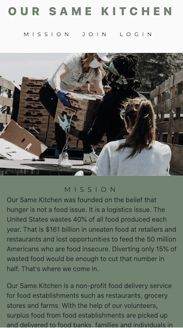
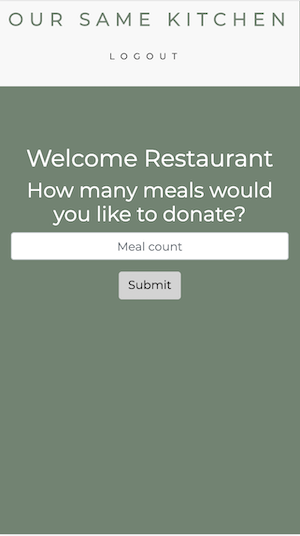

  # Our Same Kitchen
  
  
  ## Description 
  We are a non-profit who believe that hunger is not a food issue, it is a logistics issue. We seek to break the barriers to food donations; bridging the gap between food establishments with surplus food and those in need.

  The Our Same Kitchen App is a web and mobile application allowing food establishments (e.g. restaurants, grocery stores, farms) to easily add and notify our team of surplus food, and when and where to pick it up. The application uses HTML, CSS, Javascript/ES6, Nodejs, Express-Handlebars, Passport, and Sequelize. 

  
      
  
  
  
  Link to deployed application: https://the-united-rhinos.herokuapp.com/

  ## Table of Contents
  * [Installation](#installation)
  * [Usage](#usage)
  * [License](#license)
  * [Contributing](#contributing)
  * [Test Instructions](#test-instructions)
  * [Questions](#questions)

  ## Installation
    
    1. Download the Our-Same-Kitchen repository locally to your computer.   
    2. Run npm install in your bash/command line.

  ## Usage
      
    1. Locate the config folder. Navigate to config.json and ensure the user, password, and directory is the same as your local SQL workbench. 
    2. To run application, invoke with node server.js or nodemon server.js (recommended) in your bash/command line. 
    3. View the live application in your browser at localhost:8080

  ## License
  MIT (c) Hoang Nguyen   
  See LICENSE.md for details.

  ## Contributing
  Please check the app's GitHub issue tracker for known issues. Report bugs and requests to GitHub Issues.

  ## Test Instructions
  Install and run the application per instructions above. If using nodemon your terminal should display 'Server listening on: http://localhost:8080'. Check your terminal and web console for errors.

  ## Questions
  For questions, reach out to the team and I here:  
  Github: https://github.com/hngdngng  
  Email: [hoang.d.nguyen@outlook.com](mailto:hoang.d.nguyen@outlook.com)
  
